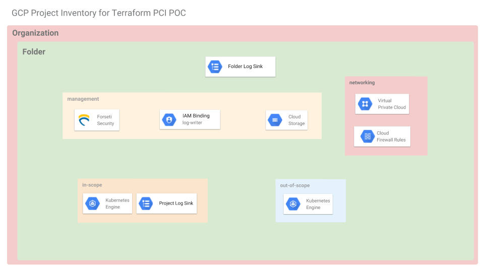
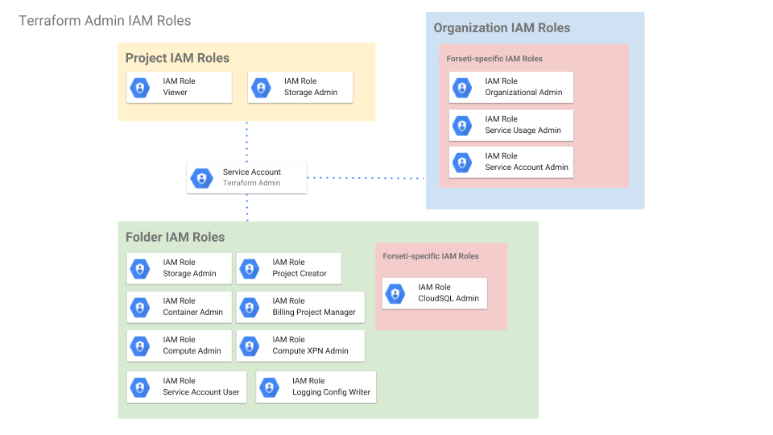
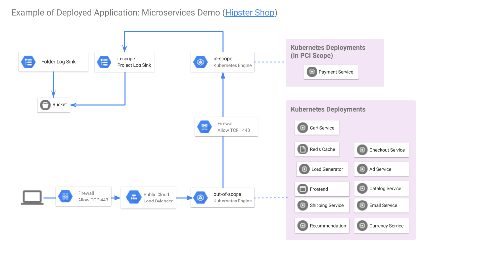
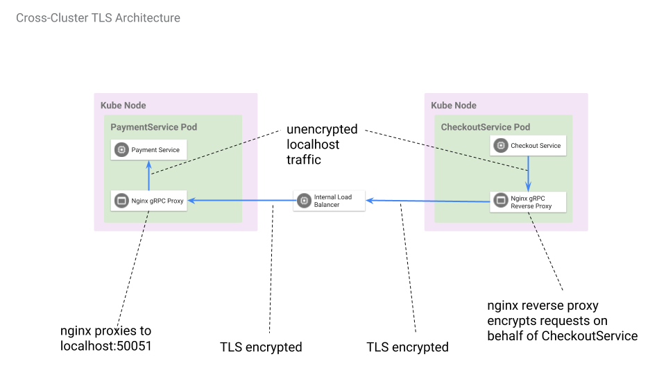

# PCI Deployable Architecture on GCP with Terraform

These terraform files build out an example PCI architecture in GCP. These have
not been certified by a PCI DSS auditor.



## Requirements

### Installation Dependencies
- [Terraform](https://www.terraform.io/downloads.html)
- [gcloud](https://cloud.google.com/sdk/gcloud/)
- [kubectl](https://kubernetes.io/docs/tasks/tools/install-kubectl/)

## Getting Started

Set-up instructions borrowed
[from](https://cloud.google.com/community/tutorials/managing-gcp-projects-with-terraform)
please read this for a detailed description of what is going on.

**NOTE**: The following steps to set up a Terraform Admin Service Account and
Project will need to be run with a GCP user with broad Organization-level
permissions.

### Required Permissions



In order to execute this module you will need to create a Service Account with the following roles:

- Project Setup
    - roles/resourcemanager.projectCreator on the folder
    - roles/billing.projectManager on the folder
    - roles/resourcemanager.projectIamAdmin on the folder
    - roles/storage.admin on the folder
    - roles/browser on the folder
- Networking
    - roles/compute.xpnAdmin on the folder
- GKE Clusters
    - roles/container.admin on the folder
    - roles/iam.serviceAccountUser on the folder
- Forseti Permissions
    - roles/serviceusage.serviceUsageAdmin on the organization
    - roles/iam.serviceAccountAdmin on the organization
    - roles/cloudsql.admin on the folder

The following section attempts to walk through the Service Account setup but
these steps may differ depending on your organization's IAM policies.

### Define Terraform Variables

Begin by setting some environment variables to configure the Terraform Admin setup

    gcloud organizations list
    gcloud beta billing accounts list

    # Choose your Organization
    export TF_VAR_org_id=YOUR_ORG_ID

    # Choose your Billing Account
    export TF_VAR_billing_account=YOUR_BILLING_ACCOUNT_ID

    # Folder that contains all projects for this demo
    export TF_VAR_folder_id=YOUR_PROJECT_FOLDER

    # Set bucket name for State files and a path to Credentials file
    export TF_ADMIN_PROJECT=${USER}-terraform-admin
    export TF_ADMIN_BUCKET=${USER}-terraform-admin
    export TF_CREDS=~/.config/gcloud/${USER}-terraform-admin.json

### Set up a Terraform Admin Project

Create your Terraform Admin project at the root of the organization or in a
Folder

    # Create project inside a folder. (You will need to create the Folder if it doesn't exist)
    gcloud alpha projects create ${TF_ADMIN_PROJECT} \
      --folder ${TF_VAR_folder_id}

    # Link Billing Account to your project
    gcloud beta billing projects link ${TF_ADMIN_PROJECT} \
      --billing-acconut=${TF_VAR_billing_account}


### Create the Terraform Admin Service Account

A service account will be used to run Terraform. Set up the account

    gcloud iam service-accounts create terraform \
      --display-name "Terraform admin account"
      --project ${TF_ADMIN_PROJECT}

    gcloud iam service-accounts keys create ${TF_CREDS} \
      --iam-account terraform@${TF_ADMIN_PROJECT}.iam.gserviceaccount.com

Enable the required APIs

    gcloud --project ${TF_ADMIN_PROJECT} services enable container.googleapis.com
    gcloud --project ${TF_ADMIN_PROJECT} services enable cloudresourcemanager.googleapis.com
    gcloud --project ${TF_ADMIN_PROJECT} services enable cloudbilling.googleapis.com
    gcloud --project ${TF_ADMIN_PROJECT} services enable iam.googleapis.com
    gcloud --project ${TF_ADMIN_PROJECT} services enable admin.googleapis.com
    gcloud --project ${TF_ADMIN_PROJECT} services enable sqladmin.googleapis.com

...and set up the proper IAM permissions


    # Add Viewer permissions for the Terraform Admin project
    gcloud projects add-iam-policy-binding ${TF_ADMIN_PROJECT} \
      --member serviceAccount:terraform@${TF_ADMIN_PROJECT}.iam.gserviceaccount.com \
      --role roles/viewer

    # Add Storage Admin permissions for the Terraform Admin project
    gcloud projects add-iam-policy-binding ${TF_ADMIN_PROJECT} \
      --member serviceAccount:terraform@${TF_ADMIN_PROJECT}.iam.gserviceaccount.com \
      --role roles/storage.admin

    # Add Storage Admin permissions to entire Folder
    gcloud alpha resource-manager folders add-iam-policy-binding ${TF_VAR_folder_id} \
      --member serviceAccount:terraform@${TF_ADMIN_PROJECT}.iam.gserviceaccount.com \
      --role roles/storage.admin

    # Add Container cluster admin permissions to entire Folder
    gcloud alpha resource-manager folders add-iam-policy-binding ${TF_VAR_folder_id} \
      --member serviceAccount:terraform@${TF_ADMIN_PROJECT}.iam.gserviceaccount.com \
      --role roles/container.admin

    # Add IAM serviceAccountUser permissions to entire Folder
    gcloud alpha resource-manager folders add-iam-policy-binding ${TF_VAR_folder_id} \
      --member serviceAccount:terraform@${TF_ADMIN_PROJECT}.iam.gserviceaccount.com \
      --role roles/iam.serviceAccountUser

    # Add Project Creator permissions to entire Folder
    gcloud alpha resource-manager folders add-iam-policy-binding ${TF_VAR_folder_id} \
      --member serviceAccount:terraform@${TF_ADMIN_PROJECT}.iam.gserviceaccount.com \
      --role roles/resourcemanager.projectCreator

    # Add Billing Project Manager permissions to all projects in Folder
    gcloud alpha resource-manager folders add-iam-policy-binding ${TF_VAR_folder_id} \
      --member serviceAccount:terraform@${TF_ADMIN_PROJECT}.iam.gserviceaccount.com \
      --role roles/billing.projectManager

    # Add Compute Admin permissions to all projects in Folder
    gcloud alpha resource-manager folders add-iam-policy-binding ${TF_VAR_folder_id} \
      --member serviceAccount:terraform@${TF_ADMIN_PROJECT}.iam.gserviceaccount.com \
      --role roles/compute.admin

    # Add Shared VPC Admin permissions to all projects in Folder
    gcloud alpha resource-manager folders add-iam-policy-binding ${TF_VAR_folder_id} \
      --member serviceAccount:terraform@${TF_ADMIN_PROJECT}.iam.gserviceaccount.com \
      --role roles/compute.xpnAdmin

...additional IAM roles for managing Forseti infrastructure.

**NOTE** Forseti requires broad permissions to operate. Therefore, the
Terraform service account needs some organization-wide grant permission.

See
<https://forsetisecurity.org/docs/v2.0/concepts/service-accounts.html#permissions>
for a full list of IAM roles that Forseti needs to operate correctly.

If you are not running the Forseti demo, skip these commands.

    gcloud organizations add-iam-policy-binding ${TF_VAR_org_id} \
      --member serviceAccount:terraform@${TF_ADMIN_PROJECT}.iam.gserviceaccount.com \
      --role roles/resourcemanager.organizationAdmin

    gcloud organizations add-iam-policy-binding ${TF_VAR_org_id} \
      --member serviceAccount:terraform@${TF_ADMIN_PROJECT}.iam.gserviceaccount.com \
      --role roles/serviceusage.serviceUsageAdmin

    gcloud organizations add-iam-policy-binding ${TF_VAR_org_id} \
      --member serviceAccount:terraform@${TF_ADMIN_PROJECT}.iam.gserviceaccount.com \
      --role roles/serviceusage.serviceAccountAdmin

    gcloud alpha resource-manager folders add-iam-policy-binding ${TF_VAR_folder_id} \
      --member serviceAccount:terraform@${TF_ADMIN_PROJECT}.iam.gserviceaccount.com \
      --role roles/cloudsql.admin

...and StackDriver Logging

    gcloud alpha resource-manager folders add-iam-policy-binding ${TF_VAR_folder_id} \
      --member serviceAccount:terraform@${TF_ADMIN_PROJECT}.iam.gserviceaccount.com \
      --role roles/logging.configWriter

### Create Terraform State Bucket

`gsutil mb -p ${TF_ADMIN_PROJECT} gs://${TF_ADMIN_BUCKET}`

Turn on versioning

`gsutil versioning set on gs://${TF_ADMIN_BUCKET}`

### Project Setup Configuration

There are several GCP projects that need to be created:

* network
* management
* in-scope
* out-of-scope

Each of these projects is in a separate folder under `projects/`.

First, copy the `projects/shared.tf.example` file to a new file at
`projects/shared.tf.local`. Replace the `remote_state_bucket` local to the value of
`${TF_ADMIN_BUCKET}`. Replace any values as necessary.

For each of the project folders, create a new `backend.tf` by copying the
`backend.tf.example` file and replacing the `bucket` value  with the value of
`${TF_ADMIN_BUCKET}`.


## Building the Demo




### Configure the Google Cloud Terraform Provider

    export GOOGLE_APPLICATION_CREDENTIALS=${TF_CREDS}
    export GOOGLE_PROJECT=${TF_ADMIN_PROJECT}

### Create the GCP Projects

1. change directories to `projects/`
2. Run `build.sh`
3. This will run the proper Terraform commands in the right order to build each project

### Create the GKE Clusters

1. change directories to `components/in-scope/infrastructure`
2. Create a new `backend.tf` by copying the `backend.tf.example` and replace
the bucket value with your Terraform state bucket
3. Run `terraform init`
4. Run `terraform apply`
5. Change directories to `components/out-of-scope/infrastructure`
6. Repeat steps 2-4
7. To verify navigate to the "[Kubernetes Engine](https://console.cloud.google.com/kubernetes/list)"
section of Google Cloud Console. There should be one cluster called `in-scope`
in your "In Scope" project and one cluster called `out-of-scope` for the Out of
Scope project.


#### Retrieve cluster credentials, and configure custom contexts

Each cluster's credentials need to be retrieved. Additionally, the rest of these
docs rely on [custom contexts](https://kubernetes.io/docs/tasks/access-application-cluster/configure-access-multiple-clusters/) being configured, since is simplifies working with
multiple clusters simultaneously.

[gcloud container clusters get-credentials](https://cloud.google.com/kubernetes-engine/docs/how-to/cluster-access-for-kubect) to set up `kubectl`'s configuration for the `in-scope` cluster
and activate its context:

Use `gcloud container clusters get-credentials in-scope --zone <ZONE> --project <IN-SCOPE-PROJECT-NAME>`

Rename the current context to the more user-friendly `in-scope`:

```
kubectl config rename-context $(kubectl config current-context) in-scope
kubectl config use-context in-scope
```

Repeat the same for the `out-of-scope` cluster:

```
gcloud container clusters get-credentials out-of-scope --zone <ZONE> --project <OUT-OF-SCOPE-PROJECT-NAME>
kubectl config rename-context $(kubectl config current-context) out-of-scope
kubectl config use-context out-of-scope
```

You can now target a specific cluster with `kubectl` by applying `--context` to
the command. For example, `kubectl --context in-scope cluster-info` will return
cluster info on the `in-scope` cluster even if the current context is something
else.


### Deploy the custom DLP API filtering fluentd daemonset

* This project includes a demonstration of the Data Loss API to filter logs from
containers before writing to Stackdriver Logs. A copy of fluentd-gcp is deployed
that includes the `fluent-plugin-gcp-dlp-filter` filter plugin. The fluentd configuration
is customized so that the paymentservice container's logs are not directly sent to
Stackdriver, but are first submitted to the DLP API for redaction. What is returned
is then logged via submission to Stackdriver Logs.

Specifically, after a purchase is completed in the microservices demo web application, a
log event such as this is generated by the payment service (paymentservice):

```
{"severity":"info","time":1555345379891,"message":"PaymentService#Charge invoked with request {\"amount\":{\"currency_code\":\"USD\",\"units\":\"41\",\"nanos\":180000000},\"credit_card\":{\"credit_card_number\":\"4432-8015-6152-0454\",\"credit_card_cvv\":672,\"credit_card_expiration_year\":2020,\"credit_card_expiration_month\":1}}","pid":1,"hostname":"paymentservice-799fb9bdd-9sqdt","name":"paymentservice-server","v":1}
```

Once sent to the DLP API, this is what is returned and logged:

```
{
...
 severity:  "INFO"  
 textPayload:  "{"severity":"info","time":1555345379891,"message":"PaymentService#Charge invoked with request {\"amount\":{\"currency_code\":\"USD\",\"units\":\"41\",\"nanos\":180000000},\"credit_card\":{\"credit_card_number\":\"[CREDIT_CARD_NUMBER]\",\"credit_card_cvv\":672,\"credit_card_expiration_year\":2020,\"credit_card_expiration_month\":1}}","pid":1,"hostname":"paymentservice-799fb9bdd-9sqdt","name":"paymentservice-server","v":1}
"  
 timestamp:  "2019-04-15T16:22:59.891425283Z"  
}
```


#### Tasks: Create a DLP Template

* Documentation: [Creating Cloud DLP de-identification templates](https://cloud.google.com/dlp/docs/creating-templates-deid)

A deidentification template needs to be created to pass to the DLP API filter configuration. There are multiple methods for creating the template. The method used here is the GCP documentation's API Explorer.

1. In a browser, navigate to https://cloud.google.com/dlp/docs/reference/rest/v2/projects.deidentifyTemplates/create
1. In the sidebar, in the "Request parameters" section, in the `parent` field,
enter `projects/<YOUR_INSCOPE_PROJECT>` eg. `projects/pci-poc-in-scope`
1. In the request field, enter these values:

       "deidentifyConfig": {
           "infoTypeTransformations": {
             "transformations": [
               {
                 "infoTypes": [
                   {
                     "name": "CREDIT_CARD_NUMBER"
                   }
                 ],
                 "primitiveTransformation": {
                   "replaceWithInfoTypeConfig": {}
                 }
               }
             ]
           }
         }
       }


1. Use the "EXECUTE" button to trigger the API call. You'll be prompted for
authentication if needed.
1. A valid API call will result in a table towards the bottom with a green header
and the string "200". Copy the value of the `name` field and use it as the value
of `DEIDENTIFY_TEMPLATE_NAME` below.

#### Build the custom fluentd-gcp container

1. From the `components/in-scope/application/fluentd-dlp` directory
1. Run `PROJECT_PREFIX=<IN_SCOPE_PROJECT_NAME> ./build.sh` which will build, tag, and push your docker container to the in-scope project. Take note of the outputted `FLUENTD_IMAGE_REMOTE_REPO` value.

#### Deploy the daemonset

1. From the `components/in-scope/application` directory
1. Generate the configuration files with:

    FLUENTD_IMAGE_REMOTE_REPO=<from above> DEIDENTIFY_TEMPLATE_NAME=<from above> ./generate-config.sh`

1. Deploy the custom fluentd Daemonset and configmap:

```
kubectl --context in-scope -n kube-system apply -f kubernetes-manifests-system/
```

1. Verify Daemonset and Configmap deployment with:

```
kubectl --context in-scope -n kube-system get configmap,daemonset
```


### Set up Logging Configuration (optional)

1. change directories to `components/logging`
2. Create a new `backend.tf` by copying `backend.tf.example` and replacing the
bucket value with your Terraform state bucket name
3. Run `terraform init`
4. Run `terraform apply`
5. Verify by checking the [Cloud Storage](https://console.cloud.google.com/storage/browser) browser
of the Management project. There should be a new logging bucket that (within
the next 30 minutes) should populate with exported logs from your In Scope
project.

### Install Forseti (optional)

1. Change directories to `components/forseti`
2. Create a new `backend.tf` by copying `backend.tf.example` and replacing the
bucket value with your Terraform state bucket name
3. Run `terraform init`
4. Run `terraform apply`
5. Verify by checking that the Management project has two new GCE instances:
one for the Forseti client and one for the Forseti server. Additionally, there
should also be a CloudSQL instance.
6. To start feeding Forseti data into your organization's Cloud SCC follow the
[instructions here](https://cloud.google.com/security-command-center/docs/how-to-output-forseti)


### Creating certificates and keys and Specifying certificates for use with your Ingress



Based on [Using multiple SSL certificates in HTTP(s) load balancing with Ingress](https://cloud.google.com/kubernetes-engine/docs/how-to/ingress-multi-ssl#specifying_certificates_for_your_ingress):

Generate a certificate:

```
export DOMAIN_NAME="hipsterservice.gflocks.com"

openssl genrsa -out hipsterservice.key 2048
openssl req -new -key hipsterservice.key -out hipsterservice.csr \
    -subj "/CN=$DOMAIN_NAME"
openssl x509 -req -days 365 -in hipsterservice.csr -signkey hipsterservice.key \
    -out hipsterservice.crt
```
Create a Secret that holds your certificate and key:

```
kubectl --context out-of-scope create secret tls tls-hipsterservice \
  --cert hipsterservice.crt --key hipsterservice.key

kubectl --context in-scope create secret tls tls-hipsterservice \
  --cert hipsterservice.crt --key hipsterservice.key
```

Verify success of the above with:

```
$ kubectl --context out-of-scope describe secrets tls-hipsterservice
Name:         tls-hipsterservice
Namespace:    default
Labels:       <none>
Annotations:  <none>

Type:  kubernetes.io/tls

Data
====
tls.crt:  1021 bytes
tls.key:  1675 bytes


$ kubectl --context in-scope describe secrets tls-hipsterservice
Name:         tls-hipsterservice
Namespace:    default
Labels:       <none>
Annotations:  <none>

Type:  kubernetes.io/tls

Data
====
tls.crt:  1021 bytes
tls.key:  1675 bytes
```

## Deploying the Microservices Demo Application

### Apply the in-scope Kubernetes configurations

```
kubectl config use-context in-scope
# from the components/in-scope/application directory
skaffold run
```

### Configure the out-of-scope cluster's Frontend
See [frontend-https](docs/frontend-https.md) for details on configuring SSL with a Google
managed SSL certificate on the frontend Load Balancer

### Apply the out-of-scope Kubernetes configurations

```
kubectl config use-context out-of-scope
# from the components/out-of-scope/application directory
skaffold run

# this retrieves the correct paymentservice address from the in-scope cluster
# and sets it as an environment variable on the checkoutservice Deployment
kubectl --context out-of-scope set env deployment/checkoutservice \
  -c nginx \
  PAYMENT_SERVICE_ILB="$(kubectl --context=in-scope get service/paymentservice-internal -o=jsonpath='{.status.loadBalancer.ingress[0].ip}'):1443"

# verify the above command with:
kubectl set env deployment/checkoutservice  --list

```

### Cleaning up

Skaffold can be used to clean up what has been deployed via `skaffold run`:

```
kubectl config use-context in-scope
cd ...components/in-scope/application
skaffold delete

kubectl config use-context out-of-scope
cd ...components/out-of-scope/application
skaffold delete
```

## Architecture

- Folder Level sink
- Shared VPC
  * 3 Subnets: Management/Forseti, PCI, Non-PCI
  * PCI Firewall denies all from 0.0.0.0/0
  * Non-PCI Firewall allows inbound http and https
- In Scope Project
    * 1 GKE Cluster for in-scope Payment service
    * Project Level sink with a filter for GCE logs
  * Out of Scope Project
    * 1 GKE Cluster for out-of-scope services
- GCS bucket for Logs
- Forseti
  * Creates Forseti service account and permissions
  * Installs Forseti

## Attribution

* The manifests for the demo application are sourced from [microservices-demo:/kubernetes-manifests](https://github.com/GoogleCloudPlatform/microservices-demo/tree/master/kubernetes-manifests).
