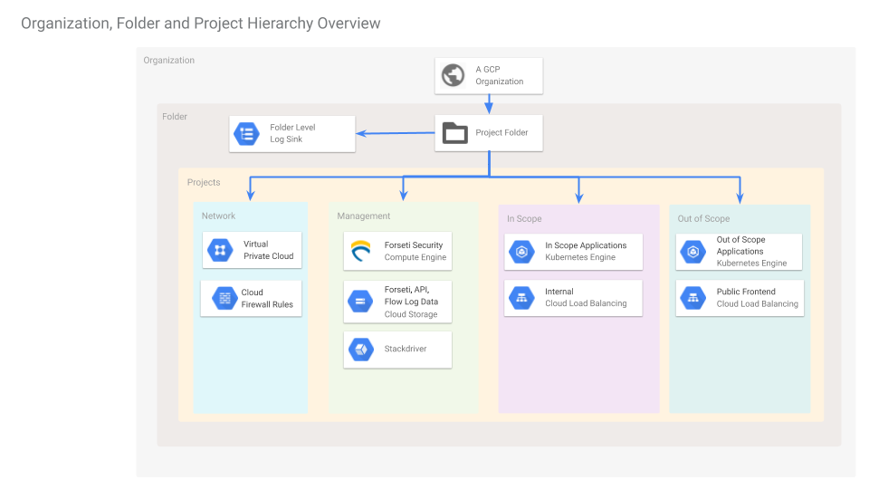
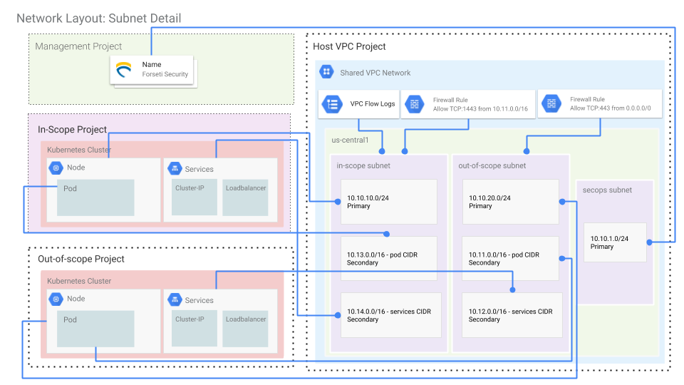
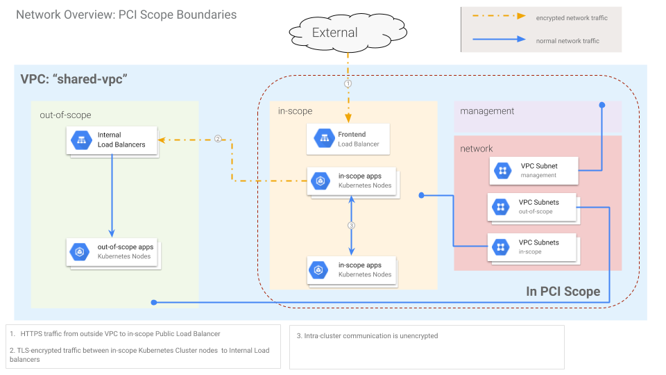

# Building the Infrastructure

This document contains detailed instructions for building this project's infrastructure.

## Design & Architecture

### Projects & Applications Detailed View

This is a diagram illustrating the projects and the resources that will be created in them. Note that some of the resources, such as the load balancers, are not created until the application is deployed.



### Network Layout: Subnet Detail

This diagram illustrates the networking and subnet details for the generated infrastructure.



### Network Overview: PCI Scope Boundaries




## Creating the Terraform Admin Project

After configuring your local environment as described in the [workstation configuration](../README.md#workstation-configuration) section in the readme, the next step is to build the infrastructure that is required for deploying the application.

* `./_helpers/build-infra.sh` contains all of the steps necessary to build the infrastructure needed before the application can be deployed. It's possible to run it directly as `./_helpers/build-infra.sh`. Alternatively, to follow along more in-depth, each command can be copied and pasted in the terminal as described here.

The first project to create is a special administrative project where Terraform
resources are kept. The most important resource here will be the Cloud Storage
bucket that will contain the Terraform state files.

To set up the admin resources run the following commands:

```
    # Source the environment setup file you created previously
    source workstation.env

    # Create the Admin project
    ./_helpers/admin_project_setup.sh
```

## Create the terraform service account

The `setup_service_account.sh` script creates the terraform service account that will be used by terraform. Additionally, it provisions that service account with the permissions it will need for its operations. Run:

```sh
./_helpers/setup_service_account.sh
```

## Configure the terraform backend bucket

The following line creates a `backend.tf` that points to the TF_ADMIN_BUCKET as defined in workstation.env and created previously in `admin_project_setup.sh`

```
cd terraform/infrastructure
sed "s/<SET TO THE VALUE OF TF_ADMIN_BUCKET>/${TF_ADMIN_BUCKET}/" terraform/infrastructure/backend.tf.example > terraform/infrastructure/backend.tf
```

## Run terraform

Continuing from the `terraform/infrastructure` directory, the following are the commands needed to be run. Note that the final command includes the creation of all of the infrastructural components: projects, the `shared-vpc` network, as well as the two clusters, among other resources. It can take anywhere from 20-45 minutes to complete, when run for the first time.

```sh
terraform init
terraform plan -out terraform.out
terraform apply terraform.out
```

## DNS

After the above `terraform apply`, public DNS settings must be updated such that `dig NS <frontend_zone_dns_name>` from the terraform output equals the `nameservers` from the terraform output.

For example, from the output of  "terraform apply":

```
frontend_zone_dns_name = a.example.com
nameservers = [
 "ns-cloud-d1.googledomains.com.",
 "ns-cloud-d2.googledomains.com.",
 "ns-cloud-d3.googledomains.com.",
 "ns-cloud-d4.googledomains.com.",
]
```

Using the appropriate DNS management method for your domain, update or create the NS record to match `a.example.com` as outputted by terraform. You can check by using `dig` should match:

```sh
$ dig +noall +answer  NS a.example.com

a.example.com. 3600	IN	NS	ns-cloud-d4.googledomains.com.
a.example.com. 3600	IN	NS	ns-cloud-d2.googledomains.com.
a.example.com. 3600	IN	NS	ns-cloud-d3.googledomains.com.
a.example.com. 3600	IN	NS	ns-cloud-d1.googledomains.com.
```
