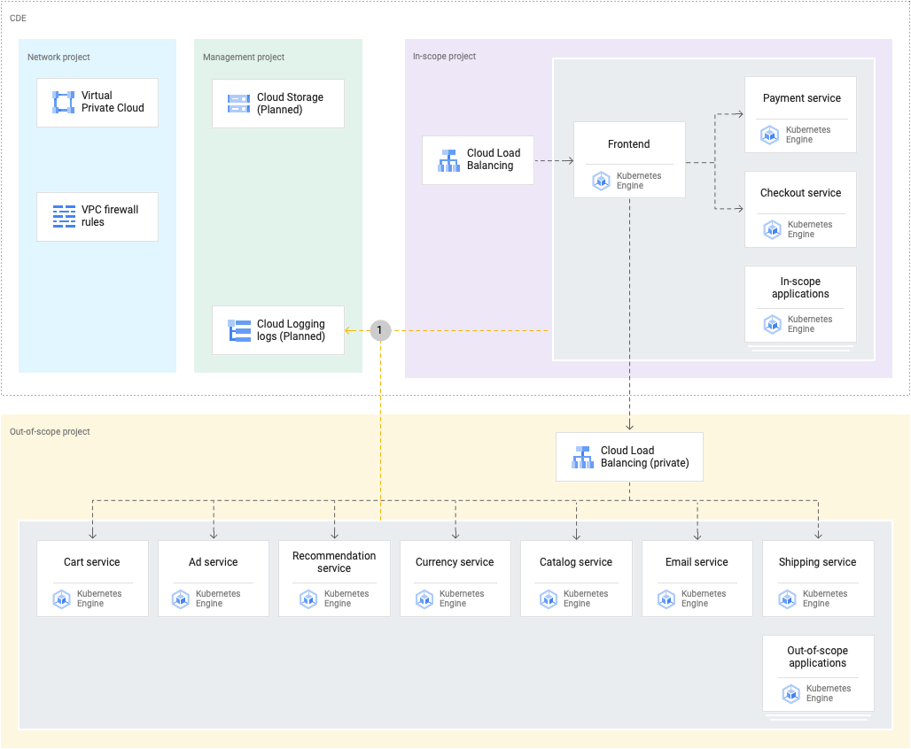
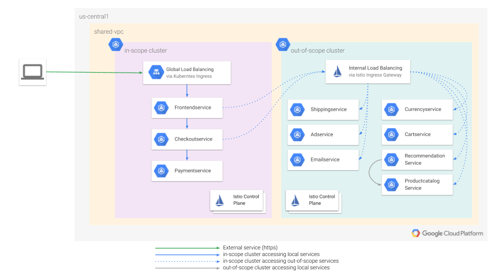
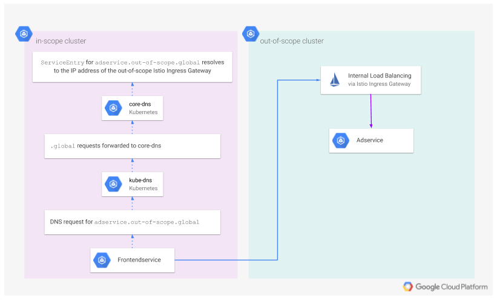

# Deploying the Microservices-Demo Application

This is a walkthrough of the steps included in `./_helpers/deploy-app.sh`

## Project and Application Detailed View

This diagram illustrates the different projects that have been created and which resources and applications will be deployed.



## Prepare Application Deployment

The application to be deployed here is named microservices-demo, which implements a mock ecommerce application called the [Hipster Store](https://github.com/GoogleCloudPlatform/microservices-demo)

In this section, we'll deploy a custom version of this Hipster Store that
separates any microservices that interact with Cardholder Data (in-scope) from those that
don't (out-of-scope).

### Retrieve Cluster Credentials and Configure Custom Contexts

* `./_helpers/deploy-app.sh` contains all the steps necessary to authenticate to Kubernetes, install Istio, and deploy the microservices-demo application. It's possible to run it directly as `./_helpers/deploy-app.sh`. Alternatively, to follow along more in-depth, each command can be copied and pasted in the terminal. Only continue here once all the steps in `build-infra.sh` are complete, including DNS updates. Those steps are spelled out in detail here.

## Retrieve Kubernetes credentials, rename the kubeconfig contexts:

Each cluster's credentials need to be retrieved so we can execute commands on
the two Kubernetes clusters. We will also set up [custom contexts](https://kubernetes.io/docs/tasks/access-application-cluster/configure-access-multiple-clusters/)
to simplify working with multiple clusters.

A custom `KUBECONFIG` is set, and then [gcloud container clusters get-credentials](https://cloud.google.com/kubernetes-engine/docs/how-to/cluster-access-for-kubect) is used to set up `kubectl`'s configuration for the clusters and activate their
contexts. `kubectx` is then used to rename the contexts to the more user-friendly `in-scope` and `out-of-scope`:

```sh
export KUBECONFIG=${SRC_PATH}/${REPOSITORY_NAME}/private/kubeconfig
gcloud container clusters get-credentials in-scope      --region us-central1 --project ${TF_VAR_project_prefix}-in-scope
gcloud container clusters get-credentials out-of-scope  --region us-central1 --project ${TF_VAR_project_prefix}-out-of-scope
kubectx in-scope=gke_${TF_VAR_project_prefix}-in-scope_us-central1_in-scope
kubectx out-of-scope=gke_${TF_VAR_project_prefix}-out-of-scope_us-central1_out-of-scope
```

## Custom Istio Installation

### Download Istio

```sh
export ISTIO_VERSION=1.3.3
cd ${SRC_PATH}
wget https://github.com/istio/istio/releases/download/${ISTIO_VERSION}/istio-${ISTIO_VERSION}-linux.tar.gz
tar -xzf istio-${ISTIO_VERSION}-linux.tar.gz
rm -i istio-${ISTIO_VERSION}-linux.tar.gz
# verify:
ls ${SRC_PATH}/istio-${ISTIO_VERSION}
```

### Install Istio custom resource definitions

```sh
for cluster in $(kubectx); do
  kubectx $cluster
  kubectl create namespace istio-system;
  kubectl create secret generic cacerts -n istio-system \
    --from-file=${SRC_PATH}/istio-${ISTIO_VERSION}/samples/certs/ca-cert.pem \
    --from-file=${SRC_PATH}/istio-${ISTIO_VERSION}/samples/certs/ca-key.pem \
    --from-file=${SRC_PATH}/istio-${ISTIO_VERSION}/samples/certs/root-cert.pem \
    --from-file=${SRC_PATH}/istio-${ISTIO_VERSION}/samples/certs/cert-chain.pem
  helm install istio-init \
    --kube-context $cluster \
    --namespace istio-system \
    ${SRC_PATH}/istio-${ISTIO_VERSION}/install/kubernetes/helm/istio-init
done
```

### Install Istio in the in-scope cluster

```sh
helm install istio \
  --kube-context in-scope \
  --namespace istio-system \
  ${SRC_PATH}/istio-${ISTIO_VERSION}/install/kubernetes/helm/istio \
  --values ${SRC_PATH}/${REPOSITORY_NAME}/k8s/values-istio-multicluster-gateways.yml
```

### Install Istio in the out-of-scope cluster

```sh
helm install istio \
  --kube-context out-of-scope \
  --namespace istio-system \
  ${SRC_PATH}/istio-${ISTIO_VERSION}/install/kubernetes/helm/istio \
  --values ${SRC_PATH}/${REPOSITORY_NAME}/k8s/values-istio-multicluster-gateways-with-ilb.yml
```

### Set the kube-dns ConfigMap in both clusters

```sh
for cluster in $(kubectx); do
  kubectx $cluster
  kubectl apply -f - << EOF
apiVersion: v1
kind: ConfigMap
metadata:
  labels:
      addonmanager.kubernetes.io/mode: EnsureExists
  name: kube-dns
  namespace: kube-system
data:
  stubDomains: |
    {"global": ["$(kubectl get svc -n istio-system istiocoredns -o jsonpath={.spec.clusterIP})"]}
EOF
done
```

### Verification steps

```sh
for cluster in $(kubectx)
do
  echo $cluster;
  kubectl --context $cluster  get crds | grep 'istio.io\|certmanager.k8s.io' | wc -l; # output should be ~23
  kubectl --context $cluster -n kube-system get configmap kube-dns -o json | jq '.data';
  kubectl --context $cluster -n istio-system get service istio-ingressgateway # don't proceed until EXTERNAL-IP is set
done
```

# Hipster Shop Installation

## Retrieve a needed environment variable

```sh
export OUT_OF_SCOPE_INGRESS_GATEWAY_IP_ADDRESS=$(kubectl get \
 --context out-of-scope \
 --namespace istio-system \
 service istio-ingressgateway \
 -o jsonpath='{.status.loadBalancer.ingress[0].ip}' \
)
```

## Add namespaces to both clusters

```sh
kubectl --context out-of-scope apply -f ${SRC_PATH}/${REPOSITORY_NAME}/k8s/namespaces/out-of-scope-namespace.yml
kubectl --context in-scope apply -f ${SRC_PATH}/${REPOSITORY_NAME}/k8s/namespaces/in-scope-namespace.yml
```

## Deploy the out-of-scope set of microservices:

```sh
helm install \
  --kube-context out-of-scope \
  --namespace out-of-scope \
  out-of-scope-microservices \
  ${SRC_PATH}/${REPOSITORY_NAME}/k8s/helm/out-of-scope-microservices
```

## Deploy the in-scope set of microservices:

```sh
helm install \
  --kube-context in-scope \
  --namespace in-scope \
  --set out_of_scope_ingress_gateway_ip_address=${OUT_OF_SCOPE_INGRESS_GATEWAY_IP_ADDRESS} \
  --set domain_name=${DOMAIN_NAME} \
  in-scope-microservices \
  ${SRC_PATH}/${REPOSITORY_NAME}/k8s/helm/in-scope-microservices
```

## Verify managed certificate creation

This project supports [Google-managed SSL certificates](https://cloud.google.com/kubernetes-engine/docs/how-to/managed-certs) for TLS encrypted communication with the frontend load balancer. In order for a valid certificate to be generated, its corresponding hostname must resolve via DNS to the IP address of the load balancer it will be applied to. If the DNS requirement as described in [Building the Infrastructure](docs/build-infrastructure.md) is satisfied, this will be handled automatically.

One of the resources created when `terraform apply` was previously run is `google_compute_address.frontend-ext-ip`, which generated a global static IP address. This address is assigned as the value of an A record in Cloud DNS as defined in `google_dns_record_set.frontend`. The IP address' name, "frontend-ext-ip" is then used in the in-scope-microservices helm chart in `/k8s/helm/in-scope-microservices/templates/ingress.yaml`:

```
kind: Ingress
metadata:
  name: frontend
  annotations:
    kubernetes.io/ingress.global-static-ip-name: frontend-ext-ip
    networking.gke.io/managed-certificates: frontend
```

The above causes a load balancer to be generated with the "frontend-ext-ip" public IP address. The `networking.gke.io/managed-certificates` causes the managed certificate to be applied to the load balancer as well.

Note that certificate provisioning can take 30-60 minutes to complete. Its status can be checked via:

```sh
kubectl --context in-scope describe managedcertificates
```

Information on the underlying GCP SSL certificate resource can be fetched with:

```
gcloud beta compute ssl-certificates list --project=${TF_VAR_project_in_scope}
```

Copy the certificate's resource name to the clipboard, and using it to view the status with:

```
gcloud beta compute ssl-certificates describe SSL_CERT_NAME --project=${TF_VAR_project_in_scope}
```

When `kubectl describe --context in-scope managedcertificates frontend-certificate` displays
`Status > Domain Status > Status: Active`, you can be sure the certificate is
generated successfully. You can then verify by loading https://$DOMAIN_NAME in a browser.


## Verify ingress health

Inspect the health status of the backend services with:

```sh
kubectl --context in-scope describe ingresses
```

The output should be similar to the below. Take note of the backend health from the lines that begins with  `ingress.kubernetes.io/backends`:

```sh
$ kubectl --context in-scope describe ingresses
Name:             frontend
Namespace:        in-scope
Address:          255.255.255.255
Default backend:  default-http-backend:80 (10.4.0.9:8080)
Rules:
  Host  Path  Backends
  ----  ----  --------
  *
        /*   frontend:80 (10.4.0.16:8080)
Annotations:
  ingress.kubernetes.io/backends:               {"k8s-be-30442--11aaa12345678a11":"HEALTHY","k8s-be-31801--11aaa12345678a11":"HEALTHY"}
  ingress.kubernetes.io/forwarding-rule:        k8s-fw-in-scope-frontend--11aaa12345678a11
  ingress.kubernetes.io/target-proxy:           k8s-tp-in-scope-frontend--11aaa12345678a11
  ingress.kubernetes.io/url-map:                k8s-um-in-scope-frontend--11aaa12345678a11
  kubernetes.io/ingress.global-static-ip-name:  frontend-ext-ip
  networking.gke.io/managed-certificates:       frontend

```

## Verify application availability

Once the certificate has been successfuly provisioned, the application should be accessible. Navigate to it in your browser at `https://$DOMAIN_NAME`, or test from the command line:

```sh
curl -s -o /dev/null -I -w "%{http_code}" https://$DOMAIN_NAME # output should be 200
curl -s http://$DOMAIN_NAME | grep -q "One-stop for Hipster Fashion" ; echo $? # output should be 0
```

# Istio Implementation

This diagram illustrates the architecture just deployed.



## Services and ServiceEntries

From the Istio documentation on [ServiceEntry](https://istio.io/docs/reference/config/networking/service-entry/):

> ServiceEntry enables adding additional entries into Istio’s internal service registry, so that auto-discovered services in the mesh can access/route to these manually specified services. A service entry describes the properties of a service (DNS name, VIPs, ports, protocols, endpoints). These services could be external to the mesh...

As shown in the diagram above, frontendservice, checkoutservice, and paymentservice are running in the in-scope cluster.  The frontend and checkout services collectively need to connect to all of the out-of-scope services. Since the out-of-scope services are external to the in-scope cluster, ServiceEntry resources are used to describe their availability. This is an excerpt of the ServiceEntry for adservice, as applied to the in-scope cluster:

```yaml
kind: ServiceEntry
metadata:
  name: adservice-entry
spec:
  hosts:
  - adservice.out-of-scope.global
...
  endpoints:
  - address: 192.168.1.2 # The IP address of the out-of-scope internal load balancer
    ports:
      grpc: 15443
```


## Cross-cluster DNS resolution

The `kube-dns` ConfigMap applied above configures the built in Kubernetes DNS resolver `kube-dns` to use coredns  for resolving `.global` DNS names. This is discussed in more detail in in the [Configuring DNS](https://cloud.google.com/solutions/building-a-multi-cluster-service-mesh-on-gke-using-replicated-control-plane-architecture#configuring_dns) section of the Google Cloud Platform Istio solutions documentation "Building a multi-cluster service mesh on GKE using replicated control-plane architecture." Illustrated below is a visualization of how cross-cluster services are resolved in DNS. This example specifically shows how frontendservice in the in-scope cluster connects to adservice, in the out-of-scope cluster:



